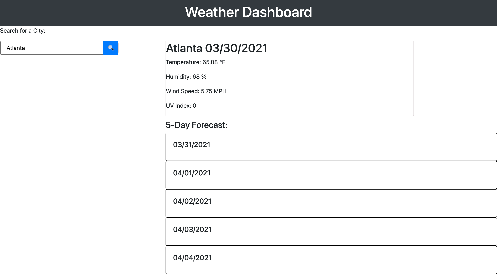

# Weather Dashboard

## [Dashboard](https://josiemald.github.io/weather-forecast/)

## [Repository](https://github.com/JosieMald/weather-forecast)



### Project:
```
Client requested a weather outlook for multiple cities to plan trips accordingly.
```

### Description
```
Created a weather dashboard were the user can search a city to view current and future condition. The user is able to see previous searches they have made including city name, date, temperature, humidity, wind speed and UV Index.
```
